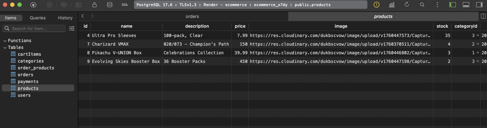
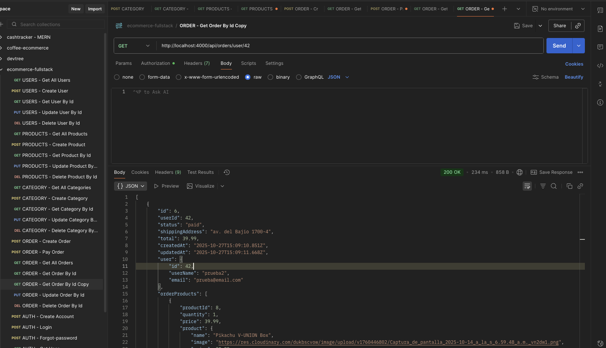

# Pokémon TCG E‑Commerce Backend

A robust, scalable backend for a Pokémon Trading Card Game e-commerce platform. Built with Node.js, Express.js, and TypeScript, this API powers user management, product catalog, orders, authentication, and admin features for the frontend.

---

## Screenshots

| Poke TCG Data base                                            | Postman Endpoints                                           |
| ------------------------------------------------------------- | ----------------------------------------------------------- |
|  |  |

---

## Features

- RESTful API for users, products, categories, orders, and authentication
- JWT-based authentication and role-based authorization
- Password hashing and secure user management
- Product catalog with categories and images
- Order creation, status updates, and history
- Admin endpoints for managing users, products, orders, and categories
- Input validation and error handling
- Rate limiting and security best practices
- Sequelize ORM for database modeling and migrations
- Written in TypeScript for type safety and maintainability

## Tech Stack & Architecture

- **Node.js** & **Express.js**
- **TypeScript**
- **Sequelize ORM** (PostgreSQL/MySQL/SQLite)
- **JWT Authentication**
- **express-validator**
- **bcrypt** (password hashing)
- **Modular structure** (controllers, routes, middleware, models)

## Project Structure

```
backend/
  src/
    controllers/   # Business logic for resources
    routes/        # API endpoint definitions
    middleware/    # Auth, validation, error handling
    models/        # Sequelize models
    config/        # DB connection, env config
    utils/         # Helper functions
  public/          # Static assets/screenshots
  README.md        # Project documentation
```

## Getting Started

```bash
# Clone the repository
git clone https://github.com/Meva1997/backend-pokemonTCG-ecommerce.git
cd backend-pokemonTCG-ecommerce

# Install dependencies
npm install

# Configure environment variables
cp .env.example .env
# Edit .env with your database URL and JWT secret

# Run the development server
npm run dev
```

## Environment Variables

Create a `.env` file with:

```
DATABASE_URL=your_database_url
JWT_SECRET=your_jwt_secret
```

## API Endpoints

### Users

- `GET /api/users` — List all users (admin only)
- `POST /api/users` — Create a new user (admin only)
- `GET /api/users/:userId` — Get user details (admin only)
- `PUT /api/users/:userId` — Update user (admin only)
- `DELETE /api/users/:userId` — Delete user (admin only)

### Products

- `GET /api/products` — List products
- `POST /api/products` — Add product (admin only)
- `GET /api/products/:productId` — Get product details
- `PUT /api/products/:productId` — Update product (admin only)
- `DELETE /api/products/:productId` — Delete product (admin only)

### Categories

- `GET /api/categories` — List categories
- `POST /api/categories` — Add category (admin only)
- `PUT /api/categories/:categoryId` — Update category (admin only)
- `DELETE /api/categories/:categoryId` — Delete category (admin only)

### Authentication

- `POST /api/auth/create-account` — Register new account
- `POST /api/auth/login` — User login (returns JWT)
- `POST /api/auth/forgot-password` — Password recovery
- `POST /api/auth/update-password` — Password update
- `POST /api/auth/check-password` — Password check

### Orders

- `GET /api/orders` — List orders (user or admin)
- `POST /api/orders` — Create order (authenticated users)
- `GET /api/orders/:orderId` — View order (owner or admin)
- `PUT /api/orders/:orderId` — Update order (owner or admin)
- `DELETE /api/orders/:orderId` — Delete order (owner or admin)
- `GET /api/orders/:orderId/user/:userId` — Get order for specific user

## Security Features

- JWT authentication and role-based access control
- Password hashing with bcrypt
- Rate limiting on sensitive routes
- Input validation and sanitization
- Error handling and logging

## Testing

Pending.

## License

This project is licensed under the MIT License. See the [LICENSE](./LICENSE) file for details.

---

This README will be updated as new features are released and the project evolves.
